# Lithology Pattern Presentation

## Sandstone

| Name                      | SVG Pattern                                                    |
| ------------------------- | -------------------------------------------------------------- |
| Sandstone                 | 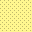                      |
| Glauconite                |                 |
| Pyrite                    | 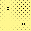                    |
| Mica                      |                       |
| Bioclastic                | 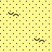                |
| Uranium Rich              |               |
| Calcite Cement            | 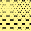            |
| Calcite Cement Uranium    | 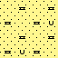    |
| Siderite Cement           | 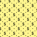           |
| Quartz Cement             | 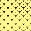             |
| Kaolinite Cement          | 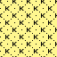          |
| Clayey                    | 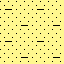                    |
| Muddy                     | 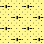                     |
| Muddy Mica                | 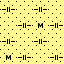                |
| Clayey Calcite Cement     |      |
| Silty                     | 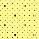                     |
| Silty Calcite Cement Mica | 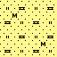 |
| Silty Mica                | 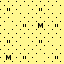                |
| Silty Kaolinite           | 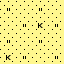           |
| Silty Kaolinite Cement    | 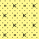    |
| Carbonaceous              | 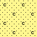              |

## Siltstone

| Name                | SVG Pattern                                              |
| ------------------- | -------------------------------------------------------- |
| Siltstone           | 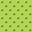                |
| Glauconite          | 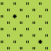          |
| Pyrite              | 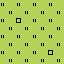              |
| Calcite Cement      |       |
| Sandy               | 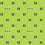               |
| Calcite Cement Mica |  |
| Carbonaceous        |                 |
| Tuff                | 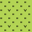                |

## Mudstone

| Name     | SVG Pattern                                  |
| -------- | -------------------------------------------- |
| Mudstone |      |
| Paleosol |  |

## Claystone

| Name                    | SVG Pattern                                                  |
| ----------------------- | ------------------------------------------------------------ |
| Claystone               |                     |
| Ooze Rich               |                |
| Glauconite              |               |
| Pyrite                  | 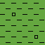                  |
| Organic Rich            | 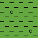            |
| Calcareous              |               |
| Dolomitic               | 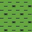               |
| Kaolinite               | 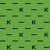               |
| Illite                  | 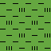                  |
| Smectite                | 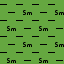                |
| Sandy                   |                    |
| Silty                   |                    |
| Silty Tuff              |                   |
| Smectite Cement Fissile | 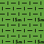 |
| Fissile                 |                  |
| Tuff                    | 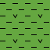                    |

## Shale

| Name                        | SVG Pattern                                                  |
| --------------------------- | ------------------------------------------------------------ |
| Shale                       |                         |
| Pyrite                      | 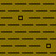                      |
| Organic Rich                | 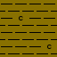                |
| Arenaceous                  |                   |
| Calcareous                  | 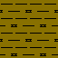                  |
| Silty                       | 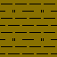                       |
| Silty Calcite Cemented Mica | 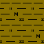 |

## Limestone

| Name         | SVG Pattern                                       |
| ------------ | ------------------------------------------------- |
| Limestone    | 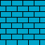         |
| Agrillaceous | 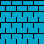 |
| Dolomitic    | 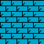    |
| Chalk        | 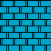        |

## Marl

| Name         | SVG Pattern                                  |
| ------------ | -------------------------------------------- |
| Marl         | 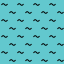         |
| Agrillaceous | 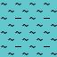 |
| Calcareous   | 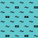   |
| Dolomitic    | 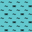    |

## Gypsum

| Name      | SVG Pattern                                 |
| --------- | ------------------------------------------- |
| Gypsum    |       |
| Anhydrite | 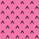 |
| Halite    | 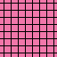    |
