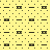
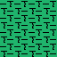
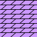

# Lithology Pattern Presentation

## Sandstone

| Pattern                                                        | Code  | Name                      |
| -------------------------------------------------------------- | ----- | ------------------------- |
|                       | 30000 | Sandstone                 |
|                 | 30017 | Glauconite                |
|                     | 30019 | Pyrite                    |
|                       | 30021 | Mica                      |
|                 | 30031 | Bioclastic                |
|               | 30066 | Uranium Rich              |
|             | 30100 | Calcite Cement            |
|     | 30166 | Calcite Cement Uranium    |
|            | 30300 | Siderite Cement           |
|              | 30400 | Quartz Cement             |
|           | 30500 | Kaolinite Cement          |
|                     | 31000 | Clayey                    |
|                      | 32000 | Muddy                     |
|                 | 32021 | Muddy Mica                |
|      | 32100 | Clayey Calcite Cement     |
|                      | 33000 | Silty                     |
|  | 33121 | Silty Calcite Cement Mica |
|                 | 33021 | Silty Mica                |
|            | 33022 | Silty Kaolinite           |
|     | 33500 | Silty Kaolinite Cement    |
|               | 30023 | Carbonaceous              |

## Siltstone

| Pattern                                                  | Code  | Name                |
| -------------------------------------------------------- | ----- | ------------------- |
|                 | 40000 | Siltstone           |
|           | 40017 | Glauconite          |
|               | 40019 | Pyrite              |
|       | 40100 | Calcite Cement      |
|                | 41000 | Sandy               |
|  | 40121 | Calcite Cement Mica |
|                 | 40023 | Carbonaceous        |
|                 | 40015 | Tuff                |

## Mudstone

| Pattern                                      | Code  | Name     |
| -------------------------------------------- | ----- | -------- |
|      | 50000 | Mudstone |
|  | 50090 | Paleosol |

## Claystone

| Pattern                                                      | Code  | Name                    |
| ------------------------------------------------------------ | ----- | ----------------------- |
|                     | 60000 | Claystone               |
|                | 60014 | Ooze Rich               |
|               | 60017 | Glauconite              |
|                   | 60019 | Pyrite                  |
|             | 60023 | Organic Rich            |
|               | 60100 | Calcareous              |
|                | 60200 | Dolomitic               |
|                | 60500 | Kaolinite               |
|                   | 60600 | Illite                  |
|                 | 60700 | Smectite                |
|                    | 61000 | Sandy                   |
|                    | 62000 | Silty                   |
|                   | 62015 | Silty Tuff              |
|  | 60738 | Smectite Cement Fissile |
|                  | 60038 | Fissile                 |
|                     | 60015 | Tuff                    |

## Shale

| Pattern                                                      | Code  | Name                        |
| ------------------------------------------------------------ | ----- | --------------------------- |
|                         | 65000 | Shale                       |
|                       | 65019 | Pyrite                      |
|                 | 65023 | Organic Rich                |
|                   | 65030 | Arenaceous                  |
|                   | 65100 | Calcareous                  |
|                        | 66000 | Silty                       |
|  | 65121 | Silty Calcite Cemented Mica |

## Limestone

| Pattern                                           | Code  | Name         |
| ------------------------------------------------- | ----- | ------------ |
|          | 70000 | Limestone    |
|  | 70026 | Agrillaceous |
|     | 72000 | Dolomitic    |
|         | 78000 | Chalk        |

## Marl

| Pattern                                      | Code  | Name         |
| -------------------------------------------- | ----- | ------------ |
|          | 80000 | Marl         |
|  | 80026 | Agrillaceous |
|    | 80100 | Calcareous   |
|     | 80200 | Dolomitic    |

## Gypsum

| Pattern                                     | Code  | Name      |
| ------------------------------------------- | ----- | --------- |
|       | 85000 | Gypsum    |
|  | 86000 | Anhydrite |
|     | 88000 | Halite    |

## Dolostone

| Pattern                                   | Code  | Name      |
| ----------------------------------------- | ----- | --------- |
|  | 74000 | Dolostone |

## Conglomerate

The pattern for the conglomerate is currently not available on Figma in SVG format.

| Pattern                                              | Code  | Name         |
| ---------------------------------------------------- | ----- | ------------ |
|          | 10000 | Conglomerate |
|  | 11030 | Sandy Matrix |
|          | 11026 | Muddy Matrix |
